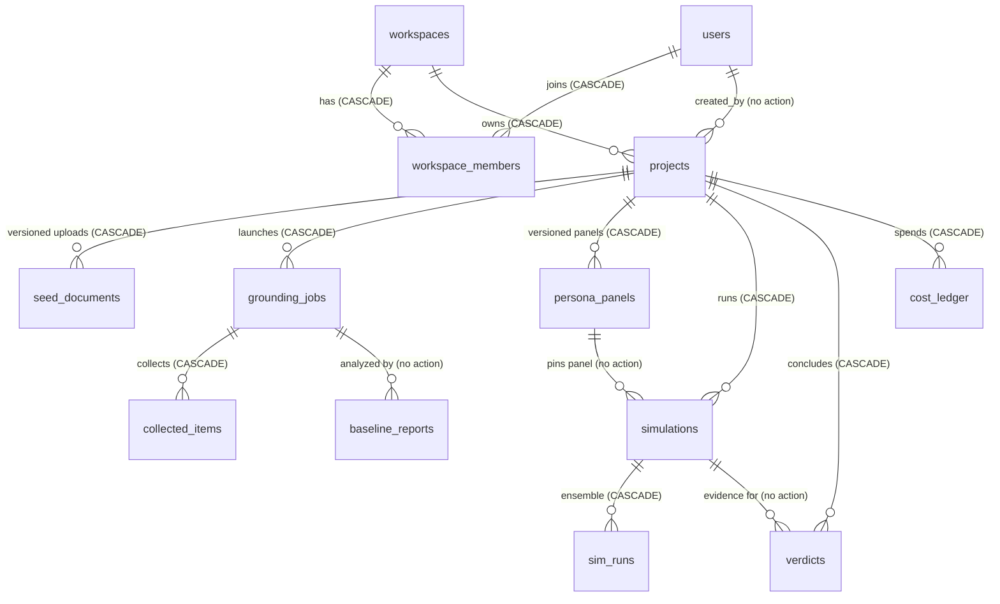

# Data Model — PostgreSQL 16 (core-api owns this schema)

**Version 0.2 · All tables live in database `crowdlens`. Migrations via Alembic.**

Extensions: migration 0001 must run `CREATE EXTENSION IF NOT EXISTS citext;` (users.email). Phase 5 adds `CREATE EXTENSION IF NOT EXISTS vector;` (pgvector, report RAG). `gen_random_uuid()` is core in PG16 — no pgcrypto needed.

PII rule: no column may contain platform-user PII (RULES.md R5). `collected_items` stores the anonymized form defined in the adapter contract.

```sql
-- ── Tenancy ─────────────────────────────────────────────
CREATE TABLE workspaces (
  id            uuid PRIMARY KEY DEFAULT gen_random_uuid(),
  name          text NOT NULL,
  logto_org_id  text UNIQUE,              -- filled in phase 3
  spend_cap_usd numeric(10,2) NOT NULL DEFAULT 100.00,
  created_at    timestamptz NOT NULL DEFAULT now()
);

CREATE TABLE users (
  id            uuid PRIMARY KEY DEFAULT gen_random_uuid(),
  email         citext UNIQUE NOT NULL,
  display_name  text,
  logto_user_id text UNIQUE,              -- filled in phase 3
  created_at    timestamptz NOT NULL DEFAULT now()
);

CREATE TABLE workspace_members (
  workspace_id  uuid REFERENCES workspaces(id) ON DELETE CASCADE,
  user_id       uuid REFERENCES users(id) ON DELETE CASCADE,
  role          text NOT NULL CHECK (role IN ('owner','analyst','viewer')),
  PRIMARY KEY (workspace_id, user_id)
);

-- ── Projects ────────────────────────────────────────────
CREATE TABLE projects (
  id            uuid PRIMARY KEY DEFAULT gen_random_uuid(),
  workspace_id  uuid NOT NULL REFERENCES workspaces(id) ON DELETE CASCADE,
  name          text NOT NULL,
  question      text NOT NULL,            -- the decision under test
  status        text NOT NULL DEFAULT 'draft'
                CHECK (status IN ('draft','grounding','grounded','simulating',
                                  'verdict_ready','no_consensus','failed','halted_budget')),
  spend_cap_usd numeric(10,2) NOT NULL,
  litellm_key   text,                     -- per-project virtual key (phase 3)
  created_by    uuid REFERENCES users(id),
  created_at    timestamptz NOT NULL DEFAULT now()
);

CREATE TABLE seed_documents (
  id           uuid PRIMARY KEY DEFAULT gen_random_uuid(),
  project_id   uuid NOT NULL REFERENCES projects(id) ON DELETE CASCADE,
  version      int  NOT NULL,
  storage_key  text NOT NULL,             -- MinIO object key
  filename     text NOT NULL,
  created_at   timestamptz NOT NULL DEFAULT now(),
  UNIQUE (project_id, version)
);

-- ── Grounding ───────────────────────────────────────────
CREATE TABLE grounding_jobs (
  id          uuid PRIMARY KEY,           -- = job_id sent to BettaFish
  project_id  uuid NOT NULL REFERENCES projects(id) ON DELETE CASCADE,
  request     jsonb NOT NULL,             -- exact POST /collect payload
  status      text NOT NULL DEFAULT 'queued'
              CHECK (status IN ('queued','running','done','failed')),
  progress    jsonb,
  created_at  timestamptz NOT NULL DEFAULT now()
);

CREATE TABLE collected_items (
  item_id       text PRIMARY KEY,         -- sha256 from adapter contract
  job_id        uuid NOT NULL REFERENCES grounding_jobs(id) ON DELETE CASCADE,
  source        text NOT NULL,
  url           text NOT NULL,
  published_at  timestamptz,
  text          text NOT NULL,
  language      text,
  metrics       jsonb,
  region        text
);
CREATE INDEX idx_items_job ON collected_items(job_id);
CREATE INDEX idx_items_source ON collected_items(source);

CREATE TABLE baseline_reports (
  id          uuid PRIMARY KEY,           -- = report_id from adapter
  job_id      uuid NOT NULL REFERENCES grounding_jobs(id),
  summary     jsonb NOT NULL,             -- adapter §1 GET /analyze shape
  verified    boolean NOT NULL DEFAULT false,  -- citation check passed
  created_at  timestamptz NOT NULL DEFAULT now()
);

-- ── Personas ────────────────────────────────────────────
CREATE TABLE persona_panels (
  id          uuid PRIMARY KEY DEFAULT gen_random_uuid(),
  project_id  uuid NOT NULL REFERENCES projects(id) ON DELETE CASCADE,
  version     int  NOT NULL,
  panel       jsonb NOT NULL,             -- adapter §2 persona_panel shape
  edited_by   uuid REFERENCES users(id),  -- null = auto-generated
  created_at  timestamptz NOT NULL DEFAULT now(),
  UNIQUE (project_id, version)
);

-- ── Simulation ──────────────────────────────────────────
CREATE TABLE simulations (
  id           uuid PRIMARY KEY,          -- = simulation_id sent to MiroShark
  project_id   uuid NOT NULL REFERENCES projects(id) ON DELETE CASCADE,
  panel_id     uuid NOT NULL REFERENCES persona_panels(id),
  request      jsonb NOT NULL,            -- exact handoff payload
  created_at   timestamptz NOT NULL DEFAULT now()
);

CREATE TABLE sim_runs (
  id             uuid PRIMARY KEY,        -- = run_id from MiroShark
  simulation_id  uuid NOT NULL REFERENCES simulations(id) ON DELETE CASCADE,
  variant_id     uuid NOT NULL,
  variant_label  text NOT NULL,
  ensemble_index int  NOT NULL,
  status         text NOT NULL DEFAULT 'running'
                 CHECK (status IN ('running','done','failed','checkpointed')),
  results        jsonb,                   -- adapter §2 results shape
  cost_usd       numeric(10,4) NOT NULL DEFAULT 0,
  created_at     timestamptz NOT NULL DEFAULT now()
);

-- ── Verdicts ────────────────────────────────────────────
CREATE TABLE verdicts (
  id                uuid PRIMARY KEY DEFAULT gen_random_uuid(),
  project_id        uuid NOT NULL REFERENCES projects(id) ON DELETE CASCADE,
  simulation_id     uuid NOT NULL REFERENCES simulations(id),
  outcome           text NOT NULL CHECK (outcome IN ('verdict','no_consensus')),
  agreement_score   numeric(4,3),         -- e.g. 0.833
  ranked_variants   jsonb,                -- [{variant_id, label, direction, support}]
  objections        jsonb,                -- [{theme, quotes:[{text, origin:'real'|'sim', ref}]}]
  risk_flags        jsonb,
  confidence        text CHECK (confidence IN ('low','medium','high')),
  report_markdown   text,
  created_at        timestamptz NOT NULL DEFAULT now()
);

-- ── Cost ledger ─────────────────────────────────────────
CREATE TABLE cost_ledger (
  id          bigserial PRIMARY KEY,
  project_id  uuid NOT NULL REFERENCES projects(id) ON DELETE CASCADE,
  component   text NOT NULL,              -- 'grounding' | 'analysis' | 'simulation' | 'verdict' | 'report'
  model_alias text,
  tokens_in   bigint,
  tokens_out  bigint,
  cost_usd    numeric(10,6) NOT NULL,
  recorded_at timestamptz NOT NULL DEFAULT now()
);
CREATE INDEX idx_ledger_project ON cost_ledger(project_id);
```

## Invariants enforced in code (not just SQL)

1. `projects.status` transitions only: `draft → grounding → grounded → simulating → (verdict_ready | no_consensus | failed)`; any state → `halted_budget`.
2. A simulation may only be created if a `baseline_reports` row with `verified = true` exists for the project's latest grounding job (Principle 1).
3. Before any simulation launches: `SUM(cost_ledger.cost_usd) + estimated_cost ≤ projects.spend_cap_usd`, else status `halted_budget`.
4. `verdicts.confidence` derives from `agreement_score`: ≥0.9 high · ≥0.8 medium · below → no verdict.

## Column reference — core 13 tables

Writers/readers are roles inside core-api (and the frontend, which only ever sees these via REST/WS — never SQL). "Fork adapter" = the core-api module that talks HTTP to BettaFish/MiroShark (RULES.md R2). Note: `users` holds **customer** accounts (allowed); the R5 PII ban applies to collected subjects, not customers.

### workspaces
| Column | Type | Meaning | Written by | Read by |
|---|---|---|---|---|
| id | uuid | Internal workspace id; all tenant scoping keys off this | core-api on create | Everywhere (tenant filter) |
| name | text | Display name | Workspace owner via API | Frontend |
| logto_org_id | text | Logto organization mapping; null until phase 3 | Auth sync (phase 3) | Auth middleware |
| spend_cap_usd | numeric(10,2) | Workspace-level budget ceiling, default $100 | Owner via API (audited `cap_change`) | Budget guard, billing UI |
| created_at | timestamptz | Immutable creation stamp | DB default | Audit, UI |

### users
| Column | Type | Meaning | Written by | Read by |
|---|---|---|---|---|
| id | uuid | Internal user id | core-api on first login / invite | FK target everywhere |
| email | citext | Login identity, case-insensitive unique | Invite / auth sync | Auth, invite flow |
| display_name | text | UI label; nullable | User profile edit | Frontend |
| logto_user_id | text | Logto subject id; null until phase 3 | Auth sync (phase 3) | Auth middleware |
| created_at | timestamptz | Immutable | DB default | Audit |

### workspace_members
| Column | Type | Meaning | Written by | Read by |
|---|---|---|---|---|
| workspace_id | uuid | Membership half of the join (CASCADE both ways) | Invite flow | Authz checks |
| user_id | uuid | Member half of the join | Invite flow | Authz checks |
| role | text | `owner` / `analyst` / `viewer` — sole authorization input | Owner via API | Authz middleware |

### projects
| Column | Type | Meaning | Written by | Read by |
|---|---|---|---|---|
| id | uuid | Project id; anchors every artifact below | core-api on create | Everywhere |
| workspace_id | uuid | Tenant owner (CASCADE) | core-api on create | Tenant filter, billing |
| name | text | Display name | Creator | Frontend |
| question | text | The decision under test; seeds `grounding_jobs.request.topic` | Creator | Grounding orchestrator, UI |
| status | text | Pipeline state machine — transitions per invariant 1 only | Pipeline orchestrator | Frontend, WS updates, budget guard |
| spend_cap_usd | numeric(10,2) | Per-project cap checked by invariant 3 | Creator (required, no default) | Budget guard |
| litellm_key | text | Per-project LiteLLM virtual key (R3); secret — never serialized to API responses | Project provisioning (phase 3) | LiteLLM call wrapper |
| created_by | uuid | Attribution; survives user erasure (no cascade — see retention) | core-api on create | Audit, UI |
| created_at | timestamptz | Immutable | DB default | UI, sorting |

### seed_documents
| Column | Type | Meaning | Written by | Read by |
|---|---|---|---|---|
| id | uuid | Row id | core-api on upload | API |
| project_id | uuid | Owner project (CASCADE) | core-api | Tenant filter |
| version | int | Upload revision; with project_id forms the unique key | core-api (max+1) | "Latest seed" queries |
| storage_key | text | MinIO object key in `crowdlens-artifacts`; bytes never in DB | Upload handler | Grounding orchestrator |
| filename | text | Original name, display only | Upload handler | Frontend |
| created_at | timestamptz | Immutable | DB default | UI |

### grounding_jobs
| Column | Type | Meaning | Written by | Read by |
|---|---|---|---|---|
| id | uuid | **Is** the `job_id` sent to BettaFish (core-api generates it) | Grounding orchestrator | BettaFish adapter, poller |
| project_id | uuid | Owner project (CASCADE) | Orchestrator | Tenant filter |
| request | jsonb | Exact `POST /collect` payload — replay + audit of what was asked | Orchestrator | Debugging, re-collect |
| status | text | Mirrors adapter status: `queued/running/done/failed` | Poller | Orchestrator, WS updates |
| progress | jsonb | Per-source `{collected, target}` from `GET /collect/{id}/status` | Poller | Progress UI |
| created_at | timestamptz | Immutable | DB default | UI |

### collected_items
| Column | Type | Meaning | Written by | Read by |
|---|---|---|---|---|
| item_id | text | sha256 of platform+native_id (adapter contract §1) — global dedupe key, so the same post fetched by two jobs exists once; second insert conflicts and is skipped | BettaFish adapter | Citation verifier, report RAG |
| job_id | uuid | Job that surfaced it (CASCADE) | Adapter | Item queries |
| source | text | Platform tag: `reddit`, `youtube`, `telegram`, ... | Adapter | Grouping, mt-01 counts |
| url | text | Canonical post URL — the clickable citation (Principle 2) | Adapter | Frontend citation links |
| published_at | timestamptz | Post time; null when unknown (R4 — never estimated) | Adapter | UI, time-window checks |
| text | text | Post/comment body, PII-stripped at the adapter boundary (R5) | Adapter | Panel builder, citation spot-checks |
| language | text | ISO code (`en`, `hi`, `mr`); null if undetected | Adapter | Phase-6 filtering |
| metrics | jsonb | Public counts only: `{score, comments}` — no usernames/avatars ever | Adapter | UI, ranking |
| region | text | `in` / `global` / null | Adapter | Phase-6 filtering |

### baseline_reports
| Column | Type | Meaning | Written by | Read by |
|---|---|---|---|---|
| id | uuid | **Is** the `report_id` returned by the adapter | BettaFish adapter | Verifier |
| job_id | uuid | Source job — **no cascade, deliberate**: evidence outlives job cleanup | Adapter | Invariant-2 gate |
| summary | jsonb | Adapter §1 `GET /analyze` shape: sentiment, themes with `citation_item_ids`, key_entities | Adapter | Handoff transformer, panel builder |
| verified | boolean | Core-api's citation check passed (every `citation_item_ids` entry exists in `collected_items`). Gates simulation (invariant 2) | Citation verifier | Simulation launcher |
| created_at | timestamptz | Immutable | DB default | Audit |

### persona_panels
| Column | Type | Meaning | Written by | Read by |
|---|---|---|---|---|
| id | uuid | Panel id | Panel builder | Simulation launcher |
| project_id | uuid | Owner project (CASCADE) | Builder | Tenant filter |
| version | int | Panel revision; unique per project | Builder (max+1) | "Latest panel" queries |
| panel | jsonb | Adapter §2 `persona_panel` shape; every `language_samples` quote traces to an `item_id` | Builder (`report-model`) or analyst edit | Handoff transformer, UI |
| edited_by | uuid | Null = auto-generated; set = human-edited revision | Panel editor | UI badge, audit |
| created_at | timestamptz | Immutable | DB default | Version list |

### simulations
| Column | Type | Meaning | Written by | Read by |
|---|---|---|---|---|
| id | uuid | **Is** the `simulation_id` sent to MiroShark | Simulation launcher | MiroShark adapter, poller |
| project_id | uuid | Owner project (CASCADE) | Launcher | Tenant filter |
| panel_id | uuid | Pinned panel version — **no cascade**: a launched sim keeps pointing at the exact panel it ran with | Launcher | Verdict engine, audit |
| request | jsonb | Exact handoff payload (adapter §2). **Contains `config.litellm_virtual_key` — treat this row as secret-bearing; never serialize to API responses** | Handoff transformer | Poller, replay |
| created_at | timestamptz | Immutable | DB default | UI |

### sim_runs
| Column | Type | Meaning | Written by | Read by |
|---|---|---|---|---|
| id | uuid | **Is** the `run_id` from MiroShark | MiroShark adapter | Poller, verdict engine |
| simulation_id | uuid | Parent sim (CASCADE) | Adapter | Grouping |
| variant_id | uuid | Decision variant this run tested (matches handoff payload) | Adapter | Verdict engine |
| variant_label | text | Human label, e.g. `Price ₹399` | Adapter | Frontend |
| ensemble_index | int | 0-based position in the 3→7 adaptive ensemble | Adapter | Ensemble logic |
| status | text | `running/done/failed/checkpointed` — checkpointed runs resume, they don't restart | Poller | Ensemble logic, UI |
| results | jsonb | Adapter §2 results shape; all `quote_refs` are simulated posts, labeled `sim` (Principle 2) | Adapter | Verdict engine, UI |
| cost_usd | numeric(10,4) | Accumulated spend for this run | Cost meter | Budget guard, UI |
| created_at | timestamptz | Immutable | DB default | UI |

### verdicts
| Column | Type | Meaning | Written by | Read by |
|---|---|---|---|---|
| id | uuid | Verdict id | Verdict engine | API, webhooks |
| project_id | uuid | Owner project (CASCADE) | Engine | Tenant filter |
| simulation_id | uuid | Source sim — **no cascade**: the verdict keeps its evidence pointer | Engine | Audit, Validation Center |
| outcome | text | `verdict` or `no_consensus` — never a forced verdict (adapter §3 rule 3) | Engine | Frontend |
| agreement_score | numeric(4,3) | Fraction of runs sharing modal direction + objection overlap, e.g. 0.833; null only with no runs (R4) | Engine | Confidence derivation, UI |
| ranked_variants | jsonb | `[{variant_id, label, direction, support}]` — null when `no_consensus` | Engine | Frontend |
| objections | jsonb | `[{theme, quotes:[{text, origin:'real'\|'sim', ref}]}]` — origin label is mandatory | Engine | Frontend evidence view |
| risk_flags | jsonb | Engine-raised caveats; shape owned by verdict engine | Engine | Frontend |
| confidence | text | Derived from `agreement_score` per invariant 4 — never set independently | Engine | Frontend |
| report_markdown | text | Rendered verdict narrative with citations | Report generator (`report-model`) | Frontend, exports |
| created_at | timestamptz | Immutable | DB default | UI, audit |

### cost_ledger
| Column | Type | Meaning | Written by | Read by |
|---|---|---|---|---|
| id | bigserial | Monotonic row id; ordering = `recorded_at` tiebreak | DB | Reconciliation |
| project_id | uuid | Charged project (CASCADE) | Cost meter | Budget guard (invariant 3) |
| component | text | `grounding/analysis/simulation/verdict/report` — which pipeline stage spent | Cost meter | Cost breakdown UI |
| model_alias | text | LiteLLM alias used (`swarm-model`/`report-model`/`embed-model`); null for non-LLM spend | Cost meter | Cost analysis |
| tokens_in / tokens_out | bigint | Token counts from LiteLLM response; null when the upstream didn't report (R4) | Cost meter | Cost analysis |
| cost_usd | numeric(10,6) | Computed spend, micro-dollar precision | Cost meter | Budget guard, Lago export |
| recorded_at | timestamptz | Immutable | DB default | Reconciliation, mt-07 drift check |

## Entity relationships

The schema is one spine with side-branches. Tenancy (`workspaces` ↔ `users` via `workspace_members`) owns `projects`; everything else hangs off a project or one of its artifacts. The pipeline order in CONTEXT.md is literally the FK chain: `seed_documents` → `grounding_jobs` → (`collected_items`, `baseline_reports`) → `persona_panels` → `simulations` → `sim_runs` → `verdicts`, with `cost_ledger` observing every stage.

Two deliberate asymmetries:

- **CASCADE stops at evidence.** Workspace/project deletion cascades through operational rows, but the links that make a claim auditable — `baseline_reports.job_id`, `simulations.panel_id`, `verdicts.simulation_id` — are plain REFERENCES with no delete action. Evidence rows are removed by retention policy (below), never as a side effect of cleaning up an upstream row.
- **External ids are primary keys.** `grounding_jobs.id`, `baseline_reports.id`, `simulations.id`, `sim_runs.id` are the ids exchanged with the forks — no surrogate/mapping tables, one id space per boundary.



## Index rationale

Only four secondary indexes exist; that is deliberate. Every other lookup in the MVP is a PK hit or a small seq scan. Add indexes only when `EXPLAIN` shows a real seq-scan problem — not preemptively.

| Index | Why it earns its write cost |
|---|---|
| `idx_items_job` on `collected_items(job_id)` | The hot read path of grounding: "all items for this job" feeds citation verification, panel building, and every spot-check. `collected_items` is the largest core table; without this, verification seq-scans it. |
| `idx_items_source` on `collected_items(source)` | Per-source counts and debugging mirror the adapter's `?source=` paging (mt-01 step 6, mt-06 step 2). |
| `idx_ledger_project` on `cost_ledger(project_id)` | The budget guard sums per project on **every** pre-launch check (invariant 3) and the cost UI aggregates per project — both must stay O(index). |
| `UNIQUE(project_id, version)` on `seed_documents` / `persona_panels` | Doubles as the index for "latest version" lookups (`WHERE project_id=… ORDER BY version DESC LIMIT 1`). |

Deliberately absent: no index on `projects(workspace_id)` (projects per workspace are low-N in MVP; a seq scan over one tenant's rows is cheap — revisit with `EXPLAIN` when a workspace exceeds ~10⁴ projects), and none on `sim_runs(simulation_id)` (≤21 runs per simulation: 3 variants × 7 max runs). Later-phase indexes (`idx_audit_workspace`, `idx_narrative_snaps`) follow the same rule: they match the exact query shape of the audit list and the narrative time-series, respectively.

## Migration ordering rules

1. **0001 is frozen**: `CREATE EXTENSION citext` + the 13 core tables verbatim (P0-T4). `pgvector` arrives only in the phase-5 migration, before `report_embeddings`.
2. **Referenced before referencing.** Creation order is the DDL file order: tenancy → projects → grounding → items/reports → panels → simulations → runs → verdicts → ledger. New migrations must respect the same dependency order.
3. **Phase tables stay in their phase.** Later-phase tables below are created only by that phase's migration — never early "to save a migration later" (P0-T4's "every table" wording is superseded by the per-phase rule in this section).
4. **Merged migrations are immutable** (contracts are law, R1). Fix forward with a new migration; never edit or squash a merged one.
5. **Expand–contract for destructive changes.** Renames/drops/type changes ship as: add new shape → backfill → switch readers/writers → drop old shape no earlier than the following phase, with a contract version bump.
6. **Downgrades must run clean** (P0-T4 gate): each `downgrade()` drops exactly what its `upgrade()` created, in reverse dependency order.

### Backfill policy

- Schema defaults cover **new** rows. Existing rows get an explicit backfill migration, never a silent runtime write.
- Backfills are idempotent and batched (≤5k rows per transaction) so they never lock hot tables (`collected_items`, `cost_ledger`).
- R4 applies to backfills: **never fabricate values**. If old rows lack data for a new NOT NULL column, ship the column nullable first, or backfill `null` + a reason marker. `verified`, `agreement_score`, and `confidence` are never backfilled to truthy values — rows without computed evidence stay empty.
- Ordering: schema migration → backfill migration → deploy code that reads the new column. Never let new readers meet unbackfilled rows.

## Data retention

Compliance floor (CONTEXT.md): no platform-user PII persisted — item id, platform, timestamp, text, public metrics only. The floor doesn't set durations; durations below are **proposed defaults**, confirm with legal before phase 8. Mechanism, where it exists today, is the DDL's cascade behavior.

| Table | Data class | Retention | Deletion mechanism |
|---|---|---|---|
| workspaces | Customer account | Life of account | Owner-initiated close → cascades everything it owns |
| users | **Customer PII** (email, display_name) | Life of account | Erasure = **anonymize** (hash email, null `display_name`/`logto_user_id`), never DELETE — `created_by`/`edited_by`/`actor_user_id` FKs have no delete action and would block it |
| workspace_members | Membership | With either side | CASCADE on workspace or user row removal |
| projects | Customer content | Life of workspace, or owner delete | CASCADE; the delete flow must order child removals per the note below |
| seed_documents | Customer uploads | With project | Row CASCADE + MinIO object deleted in the same flow (key and object must go together) |
| grounding_jobs | Operational | With project | CASCADE |
| collected_items | Third-party public posts, PII-stripped (R5) | Project lifetime — verdict citations must stay resolvable (Principle 2) | CASCADE with project. Not subject-erasure data (authors aren't platform users); takedown requests are handled by deleting rows by `item_id`/`url` |
| baseline_reports | Evidence | Project lifetime (proposed) | **No cascade from job** — removed only by project teardown or an explicit retention sweep |
| persona_panels | Derived customer content | With project | CASCADE |
| simulations | Operational + secret-bearing (`request` holds the virtual key) | With project | CASCADE; exclude `request` from exports/dumps |
| sim_runs | Simulated content, labeled `sim` | With project | CASCADE via simulation |
| verdicts | Decision record | Project lifetime (proposed: keep ≥ life of workspace for Validation Center) | CASCADE with project; `simulation_id` link is no-action |
| cost_ledger | Financial record | Proposed ≥12 months for billing dispute window | **Tension to resolve before phase 3 billing:** the CASCADE on project delete would destroy the record before Lago export — the delete flow must export/settle first |

Later-phase annotations: `audit_events` — proposed 12-month rolling retention per workspace; `actor_user_id` nulled on user erasure, row kept. `share_views.viewer_ip` (`inet`) is the closest thing to stored end-user PII in the schema — proposed 90-day retention, then null the IP or delete the row. `report_shares` rows are swept at `expires_at`. `webhook_deliveries.payload` — proposed 30-day retention, then payload scrubbed (row kept for delivery stats). `report_embeddings`, `narrative*`, `monitoring_schedules` — all CASCADE with their project.

## Later-phase tables (same database, created by their phase's migration)

These are fixed here so phase files don't define schema ad hoc.

```sql
-- ── Phase 3: audit ──────────────────────────────────────
CREATE TABLE audit_events (
  id              bigserial PRIMARY KEY,
  actor_user_id   uuid REFERENCES users(id),
  workspace_id    uuid NOT NULL REFERENCES workspaces(id) ON DELETE CASCADE,
  action          text NOT NULL,          -- login | invite | project_create | grounding_launch
                                          -- | simulation_launch | verdict_view | export | cap_change | sso_login
  target_type     text,
  target_id       text,
  metadata        jsonb,
  created_at      timestamptz NOT NULL DEFAULT now()
);
CREATE INDEX idx_audit_workspace ON audit_events(workspace_id, created_at DESC);

-- ── Phase 5: reports ────────────────────────────────────
CREATE TABLE reports (
  id          uuid PRIMARY KEY DEFAULT gen_random_uuid(),
  project_id  uuid NOT NULL REFERENCES projects(id) ON DELETE CASCADE,
  version     int  NOT NULL,
  title       text NOT NULL,
  status      text NOT NULL DEFAULT 'draft' CHECK (status IN ('draft','published','archived')),
  language    text NOT NULL DEFAULT 'en' CHECK (language IN ('en','hi','mr')),
  blocks      jsonb NOT NULL,             -- contracts/report-blocks.md shape
  created_by  uuid REFERENCES users(id),
  created_at  timestamptz NOT NULL DEFAULT now(),
  UNIQUE (project_id, version, language)
);

CREATE TABLE report_shares (
  id           uuid PRIMARY KEY DEFAULT gen_random_uuid(),
  report_id    uuid NOT NULL REFERENCES reports(id) ON DELETE CASCADE,
  token_hash   text UNIQUE NOT NULL,      -- sha256 of the share token; token itself never stored
  expires_at   timestamptz NOT NULL,      -- ≤ 30 days from creation
  watermark_seed text NOT NULL,
  created_by   uuid REFERENCES users(id),
  created_at   timestamptz NOT NULL DEFAULT now()
);

CREATE TABLE share_views (
  id          bigserial PRIMARY KEY,
  share_id    uuid NOT NULL REFERENCES report_shares(id) ON DELETE CASCADE,
  viewer_ip   inet,
  viewed_at   timestamptz NOT NULL DEFAULT now()
);

CREATE TABLE report_embeddings (          -- pgvector, phase 5; project-scoped RAG
  id          bigserial PRIMARY KEY,
  project_id  uuid NOT NULL REFERENCES projects(id) ON DELETE CASCADE,
  source_kind text NOT NULL,              -- 'block' | 'baseline' | 'verdict' | 'item_excerpt'
  source_id   text NOT NULL,
  content     text NOT NULL,
  embedding   vector(1024)                -- dim must match the configured embed-model
);

-- ── Phase 7: monitoring + BI ────────────────────────────
CREATE TABLE monitoring_schedules (
  id          uuid PRIMARY KEY DEFAULT gen_random_uuid(),
  project_id  uuid NOT NULL REFERENCES projects(id) ON DELETE CASCADE,
  cron        text NOT NULL,
  sources     jsonb NOT NULL,
  keywords    jsonb NOT NULL,
  active      boolean NOT NULL DEFAULT true,
  last_run_at timestamptz,
  created_at  timestamptz NOT NULL DEFAULT now()
);

CREATE TABLE narratives (
  id          uuid PRIMARY KEY DEFAULT gen_random_uuid(),
  project_id  uuid NOT NULL REFERENCES projects(id) ON DELETE CASCADE,
  label       text NOT NULL,
  first_seen  timestamptz NOT NULL DEFAULT now()
);

CREATE TABLE narrative_snapshots (
  id            bigserial PRIMARY KEY,
  narrative_id  uuid NOT NULL REFERENCES narratives(id) ON DELETE CASCADE,
  captured_at   timestamptz NOT NULL DEFAULT now(),
  volume        int  NOT NULL,
  sentiment     jsonb,                    -- {positive, neutral, negative}
  momentum      numeric(6,3),
  lifecycle     text CHECK (lifecycle IN ('emerging','peaking','declining')),
  driver_item_ids jsonb                   -- collected_items.item_id[]
);
CREATE INDEX idx_narrative_snaps ON narrative_snapshots(narrative_id, captured_at);

CREATE TABLE outcome_logs (               -- Validation Center / F-18
  id          uuid PRIMARY KEY DEFAULT gen_random_uuid(),
  verdict_id  uuid NOT NULL REFERENCES verdicts(id),
  outcome     text NOT NULL CHECK (outcome IN ('hit','partial','miss')),
  notes       text,
  logged_by   uuid REFERENCES users(id),
  logged_at   timestamptz NOT NULL DEFAULT now()
);

-- ── Phase 7: public API + webhooks ──────────────────────
CREATE TABLE service_tokens (
  id           uuid PRIMARY KEY DEFAULT gen_random_uuid(),
  workspace_id uuid NOT NULL REFERENCES workspaces(id) ON DELETE CASCADE,
  name         text NOT NULL,
  token_hash   text UNIQUE NOT NULL,      -- 'cpub_...' shown once, hash stored
  scopes       jsonb NOT NULL,            -- ['read:projects','read:verdicts',...]
  revoked_at   timestamptz,
  created_at   timestamptz NOT NULL DEFAULT now()
);

CREATE TABLE webhook_endpoints (
  id           uuid PRIMARY KEY DEFAULT gen_random_uuid(),
  workspace_id uuid NOT NULL REFERENCES workspaces(id) ON DELETE CASCADE,
  url          text NOT NULL,
  secret_hash  text NOT NULL,
  events       jsonb NOT NULL,            -- ['verdict.issued',...]
  active       boolean NOT NULL DEFAULT true,
  created_at   timestamptz NOT NULL DEFAULT now()
);

CREATE TABLE webhook_deliveries (
  id           bigserial PRIMARY KEY,
  endpoint_id  uuid NOT NULL REFERENCES webhook_endpoints(id) ON DELETE CASCADE,
  event        text NOT NULL,
  payload      jsonb NOT NULL,
  status       text NOT NULL DEFAULT 'pending'
               CHECK (status IN ('pending','delivered','failed')),
  attempts     int NOT NULL DEFAULT 0,
  created_at   timestamptz NOT NULL DEFAULT now()
);

-- ── Phase 8: enterprise ─────────────────────────────────
CREATE TABLE workspace_branding (         -- white-label exports (phase 5 uses this too)
  workspace_id uuid PRIMARY KEY REFERENCES workspaces(id) ON DELETE CASCADE,
  logo_key     text,                      -- MinIO object key
  accent_color text,                      -- hex
  updated_at   timestamptz NOT NULL DEFAULT now()
);

CREATE TABLE sso_configs (
  workspace_id uuid PRIMARY KEY REFERENCES workspaces(id) ON DELETE CASCADE,
  protocol     text NOT NULL CHECK (protocol IN ('saml','oidc')),
  logto_connector_id text NOT NULL,
  enabled      boolean NOT NULL DEFAULT false
);
```

Later-phase invariants:

5. Share tokens are only ever stored hashed; expiry ≤30 days is enforced at creation, not at read time.
6. `report_embeddings` queries MUST filter `project_id =` first — vector similarity is never cross-project.
7. `outcome_logs` rows are append-only (no UPDATE) — the accuracy page's credibility depends on it.
