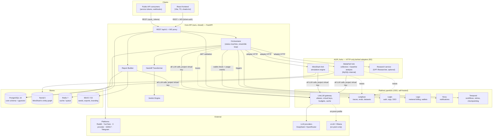

# CrowdLens — Architecture Deep-Dive

**Version 0.1 (Draft) · Date: 2026-08-25 · Status: For review**

Companion to `readme.md` (PBR §4 gives the summary; this doc gives the depth). Endpoint shapes, tables, and payloads are **not** redefined here — `ai-dev/contracts/*.md` are law (R1); where this doc and a contract disagree, the contract wins and this doc is wrong.

Reading order for a new engineer: `ai-dev/CONTEXT.md` → PBR §4 → this doc → the contract your task names.

---

## 1. Component Diagram

Steady-state (phase 8+). Before phase 8, Temporal is absent and core-api runs jobs as in-process background tasks — the arrows are the same, the durability is not (§4).



Ownership rules that the diagram encodes:

- **Core-api owns PostgreSQL.** Nothing else reads or writes it. Neo4j belongs to MiroShark; core-api reaches graph data only through the MiroShark adapter and its own `/graph/*` endpoints (phase 4).
- **LiteLLM is the only LLM path (R3).** BettaFish, MiroShark, and core-api all call it, always with the per-project virtual key — that is what makes spend attributable and caps enforceable.
- **Forks are unreachable from the network edge.** Only core-api's adapter modules may call them, with `X-Internal-Token` (adapter-contract.md §0).

---

## 2. Sequence Diagrams

### 2.1 Decision cycle, end-to-end

The fixed pipeline (`CONTEXT.md`): seed doc → grounding → persona panel → simulation (variants, ensemble) → verdict. Every gate is a hard stop, not a warning.

```mermaid
sequenceDiagram
    autonumber
    actor U as Analyst
    participant FE as Frontend
    participant API as Core API
    participant BF as BettaFish (adapter)
    participant LLM as LiteLLM
    participant MS as MiroShark (adapter)
    participant DB as PostgreSQL
    participant T as Temporal
    participant LG as Lago
    participant N as Novu

    U->>FE: create project (question, spend_cap)
    FE->>API: POST /workspaces/{wid}/projects
    API->>DB: project row (status=draft)
    U->>FE: upload seed doc
    FE->>API: POST /projects/{id}/seed
    API->>API: extract text (≤10 MB), store blob in MinIO

    U->>FE: launch grounding
    FE->>API: POST /projects/{id}/grounding
    API->>DB: grounding_jobs row (request = exact payload)
    API->>BF: POST /collect
    BF-->>API: 202 {job_id, queued}
    API->>T: start GroundingWorkflow
    T->>BF: poll GET /collect/{job_id}/status
    BF->>BF: collectors fetch platform data (official APIs)
    T->>API: upsert PII-stripped items
    API->>DB: collected_items (anonymized form, R5)
    U->>FE: run baseline analysis
    FE->>API: POST /grounding/{job_id}/analyze
    API->>BF: POST /analyze/{job_id}
    BF->>LLM: report-model calls (project virtual key)
    BF-->>API: summary (sentiment, themes, citations)
    API->>API: verify every claim cites existing item_ids
    alt citation check fails
        API->>DB: baseline_reports(verified=false)
        API-->>FE: 422 INSUFFICIENT_GROUNDING
    else verified
        API->>DB: baseline_reports(verified=true), status=grounded
    end

    FE->>API: POST /projects/{id}/persona-panel/generate
    API->>LLM: report-model: panel from verified report + samples
    API->>DB: persona_panels v1 (user edits → new version rows)

    U->>FE: launch simulation (≤3 variants)
    FE->>API: POST /projects/{id}/simulations
    API->>DB: invariant 2: verified baseline exists?
    API->>DB: invariant 3: spent + estimate ≤ spend_cap?
    API->>LG: wallet balance check
    alt any pre-flight fails
        API-->>FE: 422 INSUFFICIENT_GROUNDING / 402 BUDGET_EXCEEDED
        Note over API,DB: budget trip → status=halted_budget, Novu budget_halt
    end
    API->>API: Handoff Transformer builds payload (constraints enforced)
    API->>MS: POST /simulations (reality seed, panel, variants, config)
    MS-->>API: 202 {simulation_id, run_ids}
    API->>T: start EnsembleWorkflow (3 runs/variant)
    loop per round
        MS->>LLM: swarm-model agent turns (cached prompts)
        T->>MS: poll status; checkpoint after every round-poll
        T-->>FE: WS round events (dumb proxy, simulated:true)
    end
    API->>MS: GET /simulations/{sid}/results
    API->>API: pairwise agreement (direction + top-3 objections)
    alt agreement ≥ 0.8
        API->>LLM: report-model: verdict composition
        API->>DB: verdicts row (confidence from agreement_score)
    else < 0.8 and runs < 7
        API->>MS: launch another ensemble run
    else 7 runs, no convergence
        API->>DB: verdicts row outcome=no_consensus (never forced)
    end
    API->>LG: usage event decision_cycle
    API->>N: trigger verdict_ready / no_consensus
    N-->>U: email / in-app, deep link to verdict
```

Cost reality check against PBR §11.1: steps inside the simulation loop are the cheap part (~$2–3/cycle on `swarm-model`); grounding analysis and verdict composition run on `report-model` and dominate the ledger. The grounding budget is untouchable — cost pressure never reduces collector volume.

### 2.2 Monitoring & alert cycle (phase 7, F-16/F-39/F-40/F-41)

```mermaid
sequenceDiagram
    participant T as Temporal<br/>MonitoringWorkflow
    participant API as Core API
    participant BF as BettaFish (adapter)
    participant DB as PostgreSQL
    participant N as Novu
    participant LG as Lago

    T->>T: cron fires (monitoring_schedules.cron)
    T->>API: scheduled re-collection {project_id}
    API->>BF: POST /collect (schedule's keywords/sources)
    BF-->>API: items (paged, PII-stripped)
    API->>DB: collected_items (new job_id; old jobs retained)
    API->>API: re-run narrative clustering + KPI series
    API->>DB: narrative_snapshots (volume, sentiment, momentum, lifecycle)
    API->>API: spike detection vs trailing baseline (F-40)
    alt shift > threshold
        API->>DB: composite crisis score + driver_item_ids
        API->>N: sentiment_shift (email / WhatsApp opt-in)
        API->>API: live-mode reports: recompute changed blocks, mark diffs
    else no shift
        API->>DB: snapshots only (silent cycle)
    end
    opt schedule includes re-simulation (F-17)
        API->>API: full decision cycle (§2.1) against fresh grounding
        API->>LG: usage event monitoring_run
    end
    T->>DB: monitoring_schedules.last_run_at
```

Two honesty constraints: alerts always carry `driver_item_ids` (the posts causing the spike) — an alert without drill-down evidence violates evidence-first; and re-simulation results are labeled simulated everywhere, including inside "live" report diffs.

### 2.3 Report publish with validation gate (phase 5)

```mermaid
sequenceDiagram
    actor U as Analyst
    participant FE as Report Studio
    participant API as Core API
    participant DB as PostgreSQL
    participant LF as Langfuse
    participant W as Export worker
    participant S as MinIO

    U->>FE: compose blocks (template per vertical)
    FE->>API: POST /projects/{id}/reports
    API->>DB: reports row (status=draft, blocks jsonb)
    U->>FE: publish
    FE->>API: POST /reports/{rid}/publish
    API->>DB: gate 1 — every quantitative/quoted statement has ≥1 evidence_ref
    API->>DB: gate 2 — every ref resolves (item exists / sim post exists)
    API->>LF: gate 3 — claim-evidence consistency eval
    alt any gate fails
        API-->>FE: 422 + offending block ids
        Note over DB: status stays draft; PUT creates a new version, never mutates
    else all gates pass
        API->>DB: status=published
        API-->>FE: published (share links now issuable, ≤30d expiry)
    end
    opt export
        FE->>API: POST /reports/{rid}/export {format}
        API->>W: async render (PDF/PPTX, workspace branding)
        W->>S: artifact → presigned URL
        W->>API: usage event export (Lago)
        Note over W: SIMULATED badges + cost_ledger block survive export
    end
```

The gate exists because the report is the product's trust surface: a published report is a claim that every number inside it has receipts. `GET /share/{token}` is public and unauthenticated by design — security there is the hashed token, the expiry, and the watermark (viewer IP + timestamp in footer), not a login wall.

### 2.4 Auth + spend-cap enforcement path

```mermaid
sequenceDiagram
    actor U as User
    participant FE as Frontend
    participant LOG as Logto
    participant API as Core API
    participant LLM as LiteLLM
    participant LG as Lago
    participant DB as PostgreSQL

    U->>LOG: login (email / social / SAML-OIDC for Enterprise)
    LOG-->>FE: JWT (org = workspace)
    FE->>API: request + Authorization: Bearer JWT
    API->>LOG: validate JWT (JWKS)
    API->>DB: resolve user → workspace_members row → role
    alt role insufficient for route
        API-->>FE: 403 FORBIDDEN
    end
    API->>DB: audit_events (login, launch, export, cap_change, ...)
    Note over API: every subsequent LLM call carries the<br/>project's litellm virtual key (projects.litellm_key)
    API->>LLM: call with virtual key
    LLM->>LLM: per-key budget + rate limits (first enforcement layer)
    alt key budget exhausted
        LLM-->>API: budget error
        API-->>FE: 402 BUDGET_EXCEEDED → status=halted_budget
    end
    LLM-->>API: response + spend headers
    API->>DB: cost_ledger entry (component, alias, tokens, cost)
    Note over API,DB: core-api invariant 3 is the second layer:<br/>pre-launch estimate check; Lago wallet is the third (billing truth)
    API->>LG: reconcile nightly: Lago vs cost_ledger, drift >1% → alert
```

Enforcement is deliberately redundant — three independent layers, any one of which can halt spend:

| Layer | Where | Scope | Failure behavior |
|---|---|---|---|
| Estimate pre-flight | core-api invariant 3 | per project | refuse launch, `halted_budget` |
| Virtual-key budget | LiteLLM | per project key | LLM calls rejected at the gateway |
| Wallet balance | Lago | per workspace | refuse launch, `402` + top-up link |

`cost_ledger` remains the internal record of truth for *what things cost*; Lago is the truth for *what the customer owes*. They are reconciled nightly because billing disputes are where trust goes to die.

---

## 3. Data Flow — Where Every Byte Lives and Why

Compliance floor (R5, PBR §11): **no platform-user PII is persisted anywhere.** The strip happens at the BettaFish adapter boundary, so no downstream store can ever contain it — this is architectural, not a policy reminder.

| Data | Lives in | Why there | Notes |
|---|---|---|---|
| Workspace / user / membership records | PostgreSQL (`workspaces`, `users`, `workspace_members`) | Relational, transactional, tenancy FKs | User identity PII (email, name) is *customer* PII — allowed and protected; the ban is on *platform-user* PII |
| Seed documents (the artifact under test) | MinIO blob + `seed_documents.storage_key` | Large binary; DB keeps metadata + versions | Versioned, immutable per version |
| Collected opinion items | PostgreSQL `collected_items` (anonymized form) | Queried by job/source; citation resolution must be transactional with reports | Stored fields only: item_id (sha256), source, url, published_at, text, language, public metrics, region. Never usernames/avatars/profile links |
| Baseline analysis | PostgreSQL `baseline_reports.summary` (jsonb) | Citation verification is a DB join | `verified` flag is the Principle-1 gate |
| Persona panels | PostgreSQL `persona_panels.panel` (jsonb) | Versioned edits, proportions from real data | `edited_by` null = auto-generated |
| Handoff payloads + sim configs | PostgreSQL `simulations.request` (jsonb) | Exact replay/audit of what MiroShark was told | Contains per-project LiteLLM key reference, not the raw key material beyond provisioning |
| Sim run results | PostgreSQL `sim_runs.results` (jsonb) | Verdict engine reads them; evidence refs resolve | Working state (round-by-round posts, agent states) lives inside MiroShark; core keeps finals + WS buffer |
| Entity graph | Neo4j (MiroShark's) | Graph queries, time-scrubber, before/after | Core-api never writes Neo4j directly; `/graph/*` reads via adapter |
| Verdicts | PostgreSQL `verdicts` | The auditable product record | `outcome_logs` against verdicts are append-only (invariant 7) |
| Cost ledger | PostgreSQL `cost_ledger` | Per-project rollups, cap checks | Reconciles nightly against Lago |
| Reports + blocks | PostgreSQL `reports.blocks` (jsonb) | Versioned, validated on publish | Exports (PDF/PPTX) go to MinIO |
| Report RAG embeddings | PostgreSQL `report_embeddings` (pgvector) | ask-the-report; same DB, project-scoped | Invariant 6: `project_id =` filter first, always |
| Monitoring series | PostgreSQL `narratives` + `narrative_snapshots` | Time-series trend queries, spike detection | Driver posts referenced by item_id, not duplicated |
| LLM prompts / responses / scores | Langfuse | Tracing, eval datasets, claim-evidence eval | Contains grounded text (already PII-stripped) — treat Langfuse as in-scope for data-residency decisions |
| Billing events / wallets | Lago | Billing source of truth | `external_customer_id = workspace_id` — no user PII sent |
| Notification content | Novu | Delivery + preferences | WhatsApp opt-in stored per user |
| Auth identities | Logto | SSO, orgs, connectors | Core DB mirrors only `logto_user_id` / `logto_org_id` |
| BettaFish collector working data | BettaFish's MySQL | Fork-internal, adapter-isolated | Core pulls only the anonymized projection; fork DB is out of compliance scope *only because* the boundary strips before egress — treat it as untrusted in audits |
| Secrets (tokens, keys) | Env injection only | MT-08 secrets audit: no `.env` on prod hosts | Share tokens, service tokens, webhook secrets stored hashed — never recoverable |

Data-residency answer for enterprise sales, in one line: customer-generated content and anonymized opinion data sit in our PostgreSQL/MinIO; simulation working state sits in the MiroShark fork's stores; identity sits in Logto; nothing containing platform-user identity exists past the collector adapter.

---

## 4. Failure-Mode Catalog

Detection targets come from MT-08 (alert within 5 min of a service dying). "Data-loss risk" is honest: where it is nonzero, it says so.

| Component | Failure | Detection | Blast radius | Recovery behavior | Data-loss risk |
|---|---|---|---|---|---|
| **Single collector** (e.g. Reddit API down/rate-limited) | Source errors inside a job | Per-source progress stalls; job `failed` if all sources dead | That source missing from one grounding job | Retry per adapter error `retryable`; if a source is unavailable, job completes with the sources that worked and the coverage gap is **disclosed in the report** — never silently filled (R10, PBR §15) | None; partial grounding is a disclosure problem, not a crash |
| **BettaFish service down** | Health check + alert ≤5 min (MT-08 step 5) | No new grounding; running jobs stall | Temporal `GroundingWorkflow` retries (5 attempts, exp 10s→5min) and resumes polling after restart; jobs beyond retries marked `failed` verbatim | None — items already pulled sit in PostgreSQL | |
| **MiroShark crash mid-run** | `EnsembleWorkflow` heartbeat/poll failure | Active sims only | MiroShark checkpoints every N rounds (PBR §11); restart + resume from last checkpoint; MT-08 step 1 requires the resumed ensemble to produce a verdict identical in shape to an uninterrupted run. Runs that cannot resume are marked `failed`; the ensemble loop counts only `done` runs toward agreement | Bounded: rounds since last checkpoint, for that run only. Verdict data (in PG) unaffected | |
| **LiteLLM outage** | All LLM calls error at once; gateway health | Everything LLM: analysis, persona gen, sims, verdicts, report evals | Fail closed. Calls return `UPSTREAM_FAILURE` (retryable); Temporal retries; projects in flight pause, they do not degrade to a direct provider call (R3 — there is no fallback path around LiteLLM, because that would break spend attribution and caps) | None | |
| **Neo4j corruption** | MiroShark health/graph queries failing | Knowledge Graph Explorer, before/after views, F-27 memory | Graph Explorer degrades honestly (failed state, not an infinite spinner — frontend rule 4); verdicts and reports already in PG remain fully available. Restore Neo4j from backup; unrecoverable graph segments show as gaps with disclosure. Core decision data is untouched because verdicts never live in Neo4j | Yes — graph state between Neo4j backups. Accepted: the graph is derived/simulation state; the *verdict* record is in PostgreSQL | |
| **PostgreSQL down/corruption** | Health endpoint; everything fails | Total | Restore from nightly backup per `infra/restore.sh`; restore drill is a launch gate (MT-08 step 6) | Up to last backup — this is the one store where backup cadence directly equals data loss | |
| **Redis down** | Cache misses, queue errors | Latency; WS buffer | Degrade to direct DB reads; WS `hello` snapshot covers late joiners; resume gaps flagged and refetched via REST (ws-protocol rule 4) | WS replay buffer only (transient by design) | |
| **Temporal down** | Workflow progress stalls | All long-running jobs pause | Workflows are resumable by construction (idempotency keys = entity UUIDs); restart continues from last checkpoint | None | |
| **Logto down** | Login failures | New logins only | Existing JWTs validate until expiry (JWKS cached); on-prem profile honors the offline token refresh window (AUTH-8) | None | |
| **Lago down** | Wallet checks fail | New sim launches | **Fail closed** — refuse launches rather than bill blind; retries for usage events; nightly reconciliation catches missed events | Usage events delayed, not lost (retried) | |
| **Novu down** | Trigger errors | Notifications only | Verdicts still land in-app; triggers retried; no core flow blocks on notification delivery | Individual notifications (acceptable; in-app state is the record) | |
| **Langfuse down** | Trace export errors | Observability, publish gate 3 | Tracing is async and lossy-tolerant; the report-publish eval gate fails closed (publish blocked, report stays draft) — never auto-publish unvalidated | Traces during outage | |
| **MinIO down** | Storage errors | Seed upload, exports | Uploads fail with verbatim error; export jobs retry via `ExportWorkflow` | None (artifacts regenerable) | |
| **Ollama/vLLM node down (on-prem)** | LiteLLM backend errors | On-prem LLM path | Same as LiteLLM outage — fail closed, retry; GPU sizing tiers (24GB/48GB/2×80GB) are capacity, not redundancy — HA on-prem means a second inference node behind LiteLLM, not a bigger card | None | |

Cross-cutting rule (R10): every failure above surfaces its real error in the API and logs. A system that hides a dead collector behind a spinner has failed worse than the collector.

---

## 5. Scaling Plan — 10 → 10,000 Workspaces

These are engineering estimates from the architecture, **not measurements** — the load test (MT-08 step 10: 50 WS viewers + 10 concurrent cycles, p95 API < 500 ms) is the only hard number that exists today. Scale decisions should be revisited against real telemetry at each stage.

| Stage | Workspaces | What breaks first | What to scale |
|---|---|---|---|
| **10** (agency pilots) | ~10 | Nothing structural. Single docker-compose host suffices. Sim throughput is capped by external LLM rate limits, not by us | Nothing — spend effort on validation corpus, not infra |
| **100** | ~100 | **MiroShark sim throughput**: each decision cycle = 3–7 runs × ≤3 variants of 120 agents × ≤18 rounds. Concurrent cycles queue behind LLM rate limits. PostgreSQL `collected_items` grows ~thousands of rows/job — fine. WS fan-out trivial | MiroShark replicas behind the adapter (sim runs are independent and parallelizable); LiteLLM provider pool / multi-key rotation; move Temporal workers off the API host |
| **1,000** | ~1,000 | **PostgreSQL size** (items + narrative snapshots accumulate; monitoring multiplies collection volume) and **LiteLLM gateway** as a single point for every LLM call. Export renders (WeasyPrint/pptx) start stealing CPU. Neo4j holds many projects' graphs | PG: partition/archival policy for old `collected_items`, read replica for dashboards; LiteLLM: HA pair + Redis-backed cache warmed by prompt caching; dedicated export workers; Neo4j: backup cadence + consider per-deployment sizing |
| **10,000** | ~10,000 | **Everything stateful at once**: PG write volume from continuous monitoring (F-16), WS connection count (theater + live reports), Neo4j multi-project graph scale, support cost of per-tenant quirks | Horizontal core-api (stateless already); PG: partitioning by time on snapshots/ledger, aggressive retention on raw items post-verdict; WS tier behind a real load balancer with sticky ticket auth; sharded Neo4j or graph-per-project-cluster isolation; observability per-tenant (cost_ledger is already the per-tenant meter) |

What **never** scales down, at any stage: grounding volume and analysis quality (PBR §11.1 guardrail), the ensemble floor (3 runs minimum, ≥80% agreement), and the citation verification gates. Load shedding, if ever needed, sheds *new launches* (queue them) — it never thins the evidence under a verdict.

Deliberate non-goals in this plan: no multi-region active-active (compliance favors clear residency), no sharding of the core schema by workspace (FK integrity beats premature distribution), no caching of verdicts across tenants (F-45 benchmarks are opt-in and anonymized, and stay that way).

---

## 6. Security Architecture

### 6.1 Tenant isolation

- The **workspace is the isolation boundary**. Every core table carries `workspace_id` (directly or via `projects`), every route resolves caller → membership → role before touching data (api-surface RBAC), and role is one of `owner / analyst / viewer` enforced server-side.
- Vector search is project-scoped by invariant (data-model invariant 6): `report_embeddings` queries filter `project_id =` before similarity — RAG can never leak across projects, let alone workspaces.
- LLM spend is isolated per project via LiteLLM virtual keys; a runaway project cannot burn another project's budget, and caps are enforced at the gateway (§2.4).
- Ask-the-report and share links are the two places anonymous or cross-boundary access is possible, and both are explicit: share links are capability URLs (hashed token, ≤30d expiry, watermark), and ask-the-report answers cite only the same project's evidence.

### 6.2 Token handling

| Token | Lifetime | Storage | Rule |
|---|---|---|---|
| Logto JWT (user session) | Short-lived, refreshed | Memory in SPA; never in URLs | Bearer on REST; **never** in a WS URL (URLs end up in logs) |
| WS ticket | 60 s, single-use | Server-side, consumed on connect | Minted by `POST /simulations/{sid}/ws-ticket` (JWT-authed) |
| Report share token | ≤30 days (enforced at creation) | sha256 hash only (`report_shares.token_hash`) | Token itself never stored; watermark = viewer IP + timestamp |
| Service token (`cpub_...`) | Until revoked | Hash only, shown once | Scoped (`read:projects`, ...), revocable |
| Webhook secret | Per endpoint | Hash stored | Deliveries signed `X-CrowdLens-Signature: HMAC-SHA256(secret, body)` |
| Internal service token | Rotated per DEPLOY.md | Env injection only | `X-Internal-Token` between core-api and forks; rotation must be provably possible (MT-08 step 4) |
| LiteLLM virtual keys | Per project | `projects.litellm_key` reference | Budget-capped at the gateway |
| On-prem license key | Per deployment | License file | Startup refuses cleanly without it (MT-08 step 9); offline token refresh window per AUTH-8 |

Audit: `audit_events` records login, invite, project_create, grounding_launch, simulation_launch, verdict_view, export, cap_change, sso_login — the Enterprise answer to "who touched what."

### 6.3 AGPL boundary

- BettaFish and MiroShark are AGPL forks running as **internal services behind HTTP adapters** (R2). Our code never imports fork code; the only file we may add inside a fork tree is `Dockerfile.adapter`.
- Consequence: the copyleft boundary is the HTTP line. Core API, frontend, adapters, and all contracts remain closed/proprietary.
- Distribution obligation is handled, not ignored: on-prem customers are **offered fork source** (PBR §11), and `/legal/licenses` lists both AGPL forks with source links (MT-08 step 7 checks this).
- Risk acknowledged (PBR §15): upstream maintainer drift is managed by fork discipline (thin patches) and by the adapter contract making the engine swappable — MiroShark is replaceable without touching core-api's schema or ensemble logic, because convergence lives in core-api (adapter §3), not in the engine.

---

## 7. Deployment Topologies

Both profiles run the **same images and the same schema**; the difference is the LiteLLM backend, the identity/billing perimeter, and the license gate. The on-prem profile is the `profiles/onprem` compose overlay (MT-08 step 9), not a fork of the codebase.

| Concern | SaaS (cloud) | On-prem / air-gapped (F-21) |
|---|---|---|
| Entry | TLS on the product domain; CORS locked to it (MT-08 step 3) | Customer network; single docker-compose or Helm chart (PBR §11) |
| LLM backend | LiteLLM → DeepSeek / OpenRouter | LiteLLM → local vLLM/Ollama; **zero external LLM calls**, verified in network logs (MT-08 step 9) |
| GPU | None (inference is external) | Sizing tiers: 24GB / 48GB / 2×80GB (PBR §11); swarm-model and report-model aliases map to local models — quality deltas vs cloud models are disclosed, per honest-confidence |
| Identity | Logto cloud-side; social login; SAML/OIDC for Enterprise | Self-hosted Logto in the stack; SSO to customer IdP; offline token refresh window (AUTH-8) |
| Billing | Lago metering, wallets, top-up links | License-key activation; Lago runs locally for internal cost visibility, no external billing calls |
| Notifications | Novu → email/Slack/WhatsApp providers | Novu → customer SMTP/webhook only; WhatsApp unavailable air-gapped |
| Data collectors | Full source matrix (PBR §9) | Only sources reachable from the customer network; coverage gaps disclosed per report, same as any collector outage |
| AGPL compliance | Forks internal, `/legal/licenses` published | Forks ship with the stack; **source offered to the customer** (PBR §11) |
| Upgrades | Continuous | Versioned bundle; license file gates startup; removing it → clean refusal, not a crash (MT-08 step 9) |
| Evidence trail | Langfuse central | Langfuse in-stack; eval datasets do not leave the deployment |

The invariant across both: the pipeline (ground → simulate → verdict) and its gates (citation verification, ensemble convergence, publish validation, spend caps) are identical. Deployment profile changes *where* compute and identity live, never *what the product is willing to claim*.

---

*End of architecture deep-dive v0.1. Contracts referenced: adapter-contract.md, api-surface.md, data-model.md, websocket-protocol.md, report-blocks.md, platform-services.md, frontend-spec.md. Production behaviors referenced: MT-08 (launch gate).*
